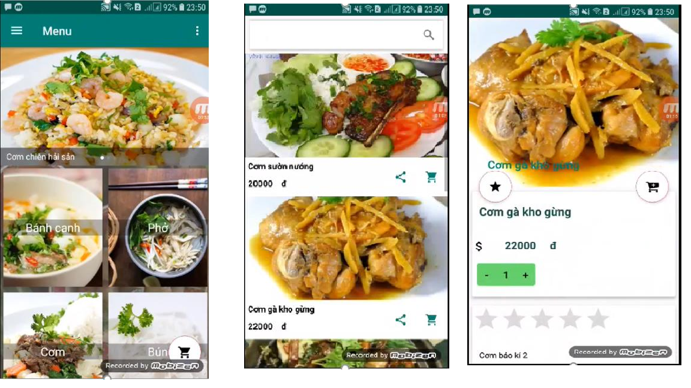
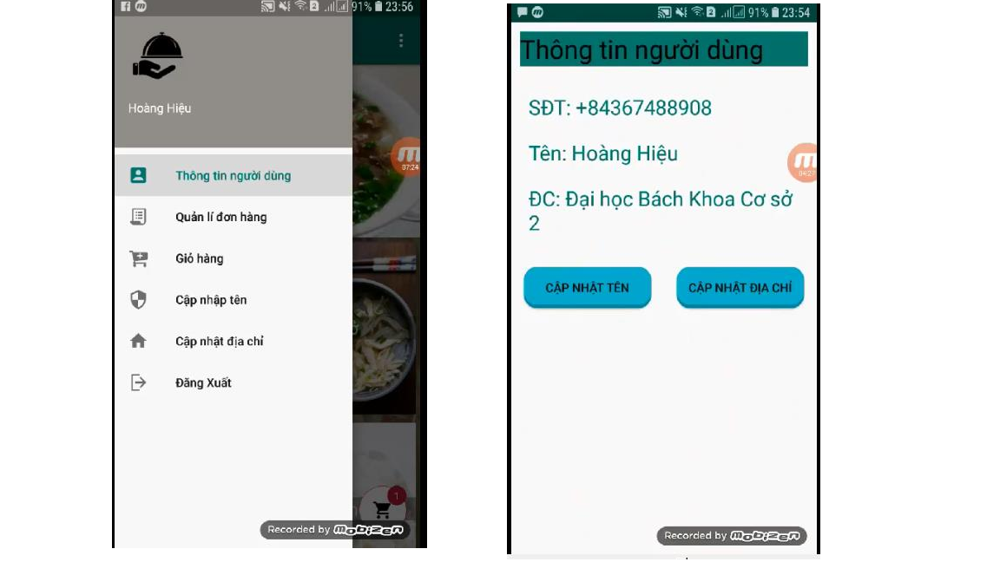
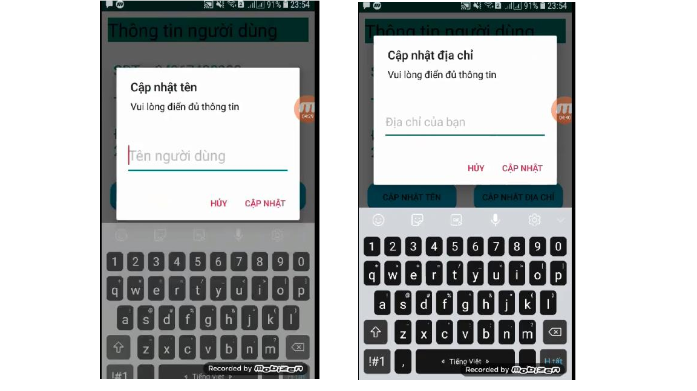
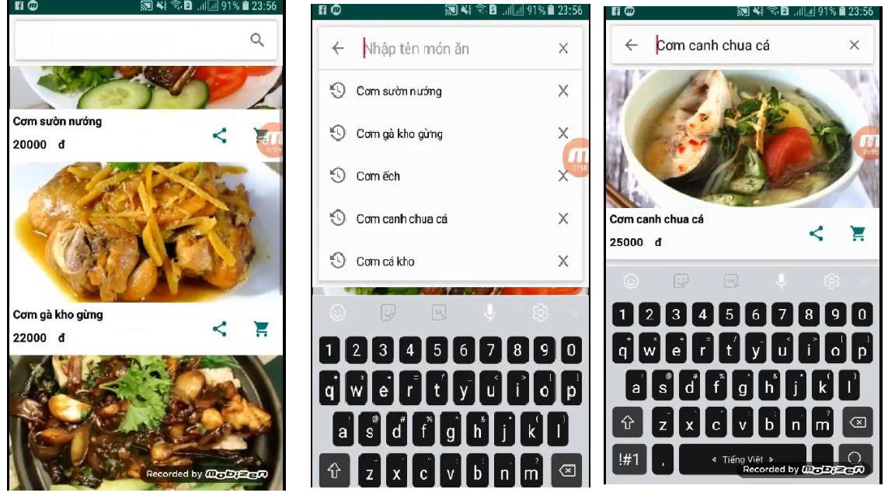
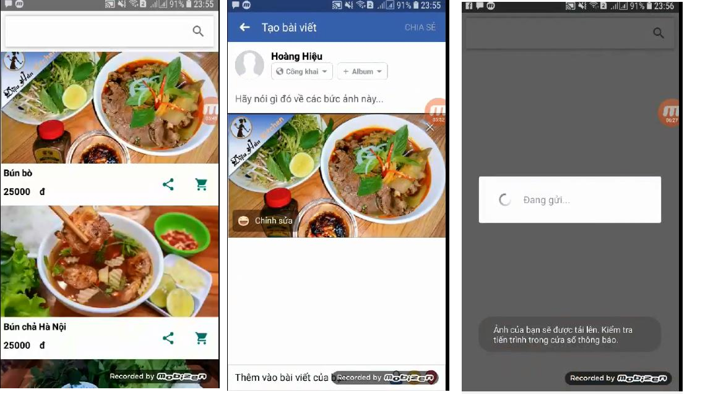
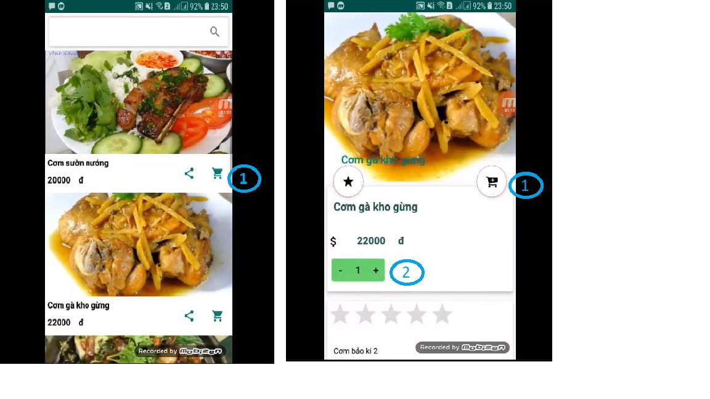
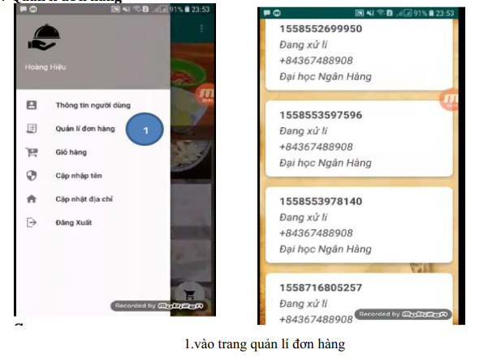
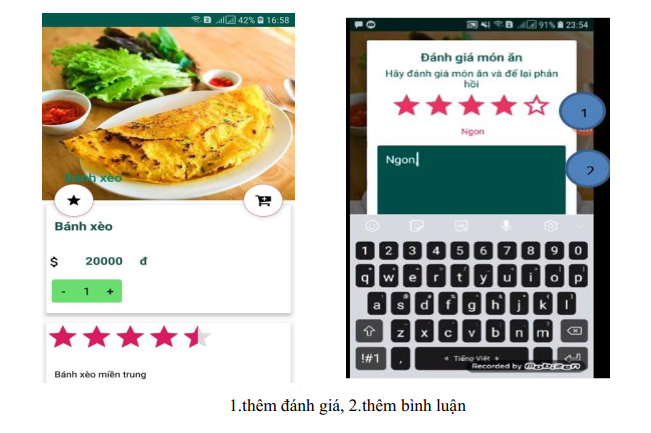

# OrderFood Application
<h2>App screens</h2>
<h3>Login</h3>

  

<h3>Home & View dishs</h3>

  

<h3>User Information</h3>

  

<h3>Update Information</h3>

  

<h3>Search dishs</h3>

  

<h3>Sharing with facebook</h3>

  

<h3>Add to Cart</h3>

  

<h3>Get order</h3>

  

<h3>Manage order</h3>

  

<h3>Comment</h3>

  

